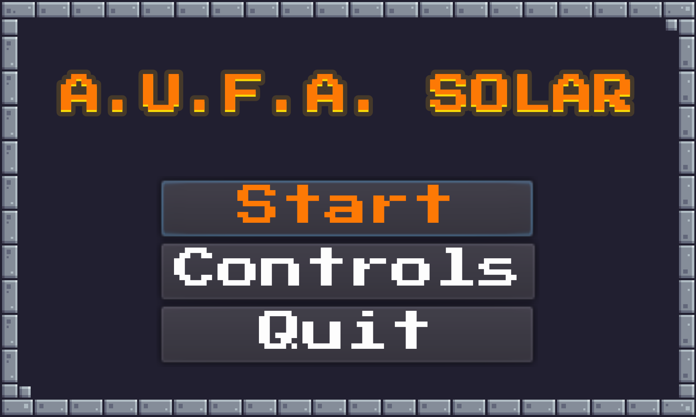
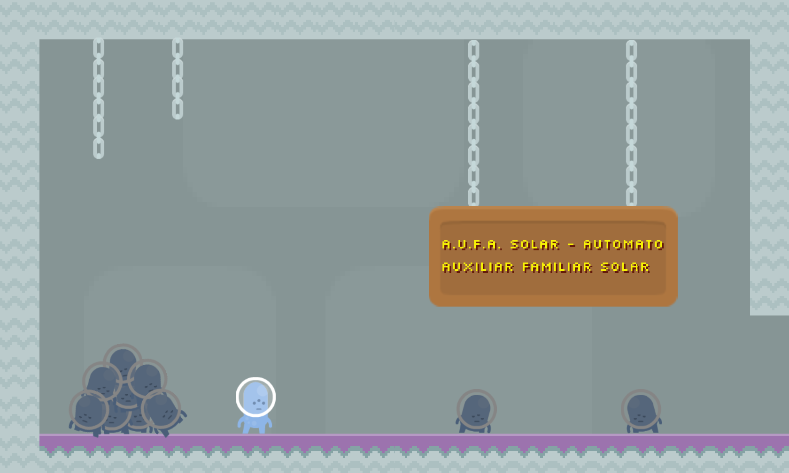
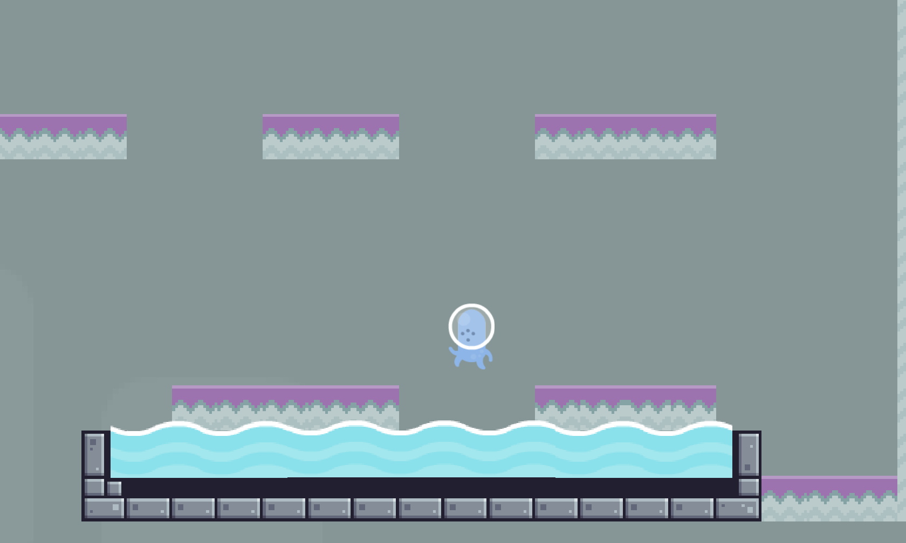
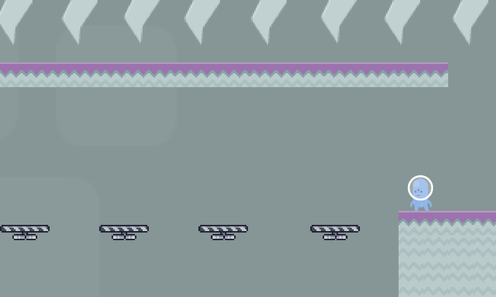
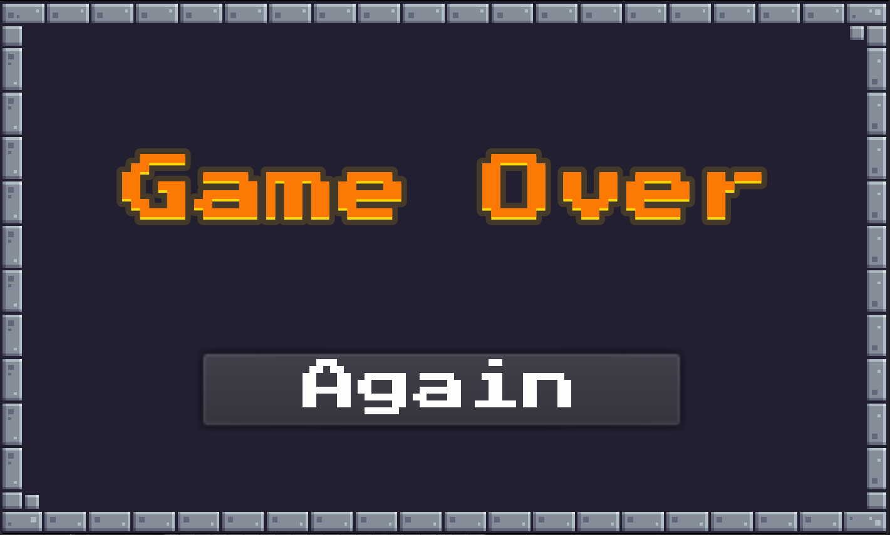
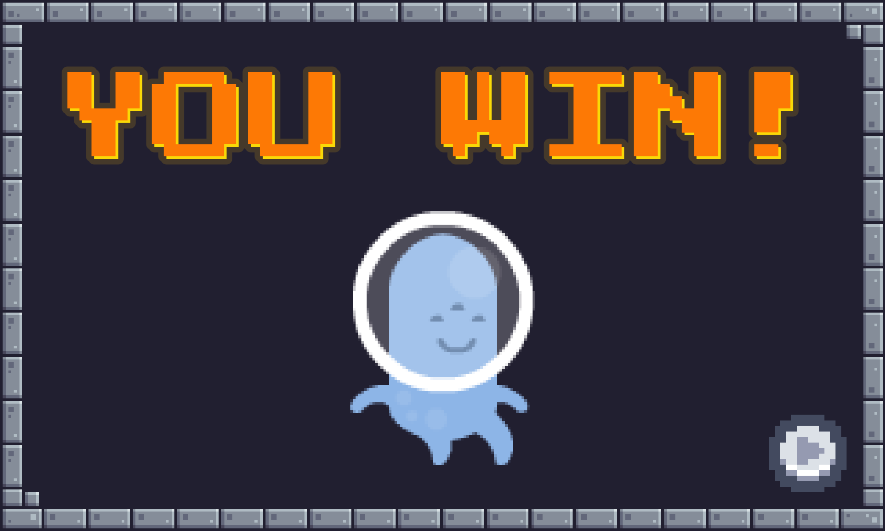

<div align="center">


# A.U.F.A. SOLAR

**Um jogo de plataforma 2D em pixel art sobre acordar no escuro e correr atrás da luz.**



[](https://godotengine.org/)
[](https://docs.godotengine.org/en/3.5/tutorials/scripting/gdscript/index.html)
[](#como-jogar)
[](#)

**[Assista ao gameplay](#gameplay-em-vídeo)** · **[🎮 Baixe e jogue](#onde-está-o-executável)**

*Projeto final da cadeira de Introdução à Programação — Engenharia de Computação*

</div>

---

## Sumário

- [Sobre o projeto](#sobre-o-projeto)
- [O jogo](#o-jogo)
- [Como jogar](#como-jogar)
- [Capturas de tela](#capturas-de-tela)
- [Gameplay em vídeo](#gameplay-em-vídeo)
- [Mecânicas](#mecânicas)
- [Fases](#fases)
- [Arquitetura do projeto](#arquitetura-do-projeto)
- [Rodando a partir do código-fonte](#rodando-a-partir-do-código-fonte)
- [Equipe](#equipe)

---

## Sobre o projeto

**A.U.F.A. Solar** é um jogo de plataforma 2D desenvolvido como **projeto final da disciplina de Introdução à Programação**, no curso de Engenharia de Computação.

O objetivo acadêmico do trabalho era aplicar, num produto completo e jogável, os fundamentos vistos na cadeira: variáveis e tipos, estruturas condicionais, laços de repetição, funções, vetores e o básico de orientação a objetos, tudo isso dentro do ciclo real de desenvolvimento de um jogo, que inclui também arte, som, level design e empacotamento para distribuição.

| | |
|---|---|
| **Engine** | Godot Engine 3.5.1 |
| **Linguagem** | GDScript |
| **Gênero** | Plataforma 2D / Precision platformer |
| **Estilo visual** | Pixel art, resolução nativa 320×192 |
| **Modo de jogo** | Single-player |
| **Plataforma** | Windows (executável) |
| **Estúdio** | ShineStar Studios |
| **Ano** | 2023 |

> **Conceito e inspiração**
>
> * Diel escreva aqui de onde veio a ideia do jogo: o que significa "A.U.F.A.", qual foi a inspiração
> (jogos de referência, etc), e qual sensação nós
> queriamos provocar no jogador.*

---

## O jogo

<div align="center">

<br>
<em>A placa logo no início da fase 1 entrega o significado da sigla — e a pilha de autômatos desligados conta o resto.</em>
</div>

> **Sinopse**
>
> *Conte aqui a história do jogo. Quem é o personagem? Onde ele acordou?
> O que ele está buscando? O jogo abre com uma cutscene do
> personagem despertando (`PlayerInit`), então vale a pena explicar o que aconteceu antes disso.*

**Loop de jogo em uma frase:** você acorda em um mundo hostil, atravessa três fases desviando de armadilhas mortais — e **um único toque acaba com tudo**.

### Pilares de design

| Pilar | O que significa na prática |
|---|---|
| 🩶 **Fragilidade** | O jogador tem 1 ponto de vida. Qualquer contato com espinhos, água ou inimigos reinicia a tentativa. |
| ⚡ **Leitura rápida** | Plataformas que caem, tetos que descem: o cenário reage e obriga a decidir em frações de segundo. |
| 🎨 **Clareza visual** | Paleta e pixel art de baixa resolução para que cada perigo seja identificável de imediato. |

---

## Como jogar

### Onde está o executável

O jogo já vem **compilado e pronto para jogar** neste repositório:

```
Export/
├── A.U.F.A. SOLAR.exe   ← execute este arquivo
└── A.U.F.A. SOLAR.zip   ← mesma build, compactada
```

**Passo a passo:**

1. Baixe o repositório (**Code → Download ZIP**) ou clone-o:
   ```bash
   git clone https://github.com/DansLean/A.U.F.A.-SOLAR.git
   ```
2. Abra a pasta `Export/`.
3. Dê duplo clique em **`A.U.F.A. SOLAR.exe`**.
4. Boa sorte.

> ⚠️ **Windows SmartScreen:** por ser um executável sem assinatura digital, o Windows pode exibir um aviso.
> Clique em **Mais informações → Executar assim mesmo**.
>
> 💡 O arquivo `.zip` contém a mesma build — útil se você precisar enviar o jogo para outra pessoa.

### Controles

| Ação | Tecla |
|:---|:---|
| Mover para a esquerda | <kbd>←</kbd> |
| Mover para a direita | <kbd>→</kbd> |
| Pular | <kbd>Espaço</kbd> |
| Navegar nos menus | <kbd>↑</kbd> <kbd>↓</kbd> / <kbd>Enter</kbd> |
| Sair do jogo | Botão **Quit** no menu principal |

*(A tela **Controls**, acessível pelo menu principal, mostra esse mesmo esquema dentro do jogo.)*

---

## Capturas de tela

<div align="center">

| Menu principal | Fase 1 — o despertar |
|:---:|:---:|
|  |  |
| *Start, Controls e Quit — navegação por teclado* | *A pilha de autômatos desligados e a placa de apresentação* |

| Fase 2 — a travessia | Fase 3 — as lâminas |
|:---:|:---:|
|  |  |
| *Saltos calculados sobre a poça d'água mortal* | *Plataformas suspensas sob um teto de espinhos* |

| Game Over | Vitória |
|:---:|:---:|
|  |  |
| *Um toque basta — o botão **Again** devolve ao menu* | *O autômato finalmente sorri* |

</div>

---

## Gameplay em vídeo

<div align="center">

<!--
  O player abaixo lê o arquivo READMEFiles/Gameplay.mp4 direto do repositório.
  Se por algum motivo ele não tocar na página do GitHub, a alternativa mais garantida é:
  abrir uma issue no repo, arrastar o Gameplay.mp4 para a caixa de texto, copiar o link
  gerado (https://github.com/user-attachments/assets/...) e usá-lo no src deste <video>.
-->
<video src="https://github.com/DansLean/A.U.F.A.-SOLAR/raw/main/READMEFiles/Gameplay.mp4" width="720" controls muted playsinline></video>

**[Baixar o vídeo de gameplay](READMEFiles/Gameplay.mp4)** *(1920×1080 · ~16 MB)*

<em>Partida completa: do despertar na fase 1 até a tela de vitória.</em>

</div>

---

## Mecânicas

### O personagem

O jogador controla um `KinematicBody2D` com física escrita à mão — nada de motor de personagem pronto:

| Parâmetro | Valor | Efeito no jogo |
|---|---:|---|
| `move_speed` | `480` | Velocidade horizontal |
| `gravity` | `1200` | Queda rápida, pulo "pesado" |
| `jump_force` | `-720` | Altura do salto |
| `health` | `1` | **Um toque = morte** |
| `knockback_int` | `500` | Empurrão ao levar dano |

A detecção de chão é feita por um conjunto de `RayCast2D` (nó `$raycasts`), o que dá controle fino sobre quando o pulo é permitido. As animações — `idle`, `run`, `jump`, `hit` — trocam automaticamente conforme velocidade e estado de contato com o solo.

### Armadilhas e obstáculos

| Obstáculo | Cena / Script | Comportamento |
|---|---|---|
| 🧱 **Plataforma instável** | `FallingPlatform` | Treme ao ser pisada e despenca logo depois; reaparece após `reset_timer` segundos |
| ⬇️ **Teto descendente** | `FallingRoof` | Desce continuamente e esmaga quem ficar parado |
| 🔺 **Espinhos** | `espinhos.tscn` | Dano por contato — morte imediata |
| 💧 **Água** | `Watertrap` | Poça mortal no chão da fase |
| 🕳️ **Zona de queda** | `FallZone` | Área invisível abaixo do nível; cair nela leva direto ao Game Over |

### Fluxo de telas

```
StartScreen ──▶ StartLevel ──▶ level_01 ──▶ level_02 ──▶ level_03 ──▶ EndGame
     │          (cutscene:                   │                         (YOU WIN!)
     │        o personagem                   │
     │           acorda)                     ▼
     │                                   GameOver ──┐
     ├──▶ ControlScreen ──▶ (volta)                 │
     │                                              │
     └◀─────────────────────────────────────────────┘
```

Cada fase termina com um `Area2D` posicionado na linha de chegada: ao detectá-lo, o player é removido e a cena seguinte é carregada.

---

## Fases

> *Descreva abaixo o que torna cada fase diferente: qual mecânica ela apresenta e qual é o
> desafio central. Isso ajuda quem for jogar (e o professor) a entender as decisões de level design.*

### Fase 1 — *nome da fase*


**Introduz:** *(mecânica principal)*

*Descrição do level design da fase 1.*

### Fase 2 — *nome da fase*


**Introduz:** *(mecânica principal)*

*Descrição do level design da fase 2.*

### Fase 3 — *nome da fase*


**Introduz:** *(mecânica principal)*

*Descrição do level design da fase 3.*

---

## Arquitetura do projeto

```
A.U.F.A.-SOLAR/
├── project.godot          # Configuração da engine (resolução, inputs, autoloads)
├── export_presets.cfg     # Presets de exportação (Windows e HTML5)
│
├── Scripts/               # Toda a lógica em GDScript
│   ├── Global.gd          #   Singleton (autoload) — contagem de estrelas
│   ├── Player.gd          #   Movimento, pulo, animação, dano e knockback
│   ├── HUD.gd             #   Exibição do contador de estrelas
│   ├── Star.gd            #   Coletável
│   ├── FallingPlatform.gd #   Plataforma que desaba
│   ├── FallingRoof.gd     #   Teto descendente
│   ├── FallZone.gd        #   Morte por queda
│   ├── TimeCounter.gd     #   Cronômetro regressivo
│   ├── level_01..03.gd    #   Transição entre as fases
│   └── StartScreen.gd, ControlScreen.gd, GameOver.gd, EndGame.gd, PlayerInit.gd
│
├── Scenes/                # Telas e objetos (.tscn)
├── Levels/                # level_01.tscn, level_02.tscn, level_03.tscn
├── Prefabs/               # Camera2D, Background, HUD, hitbox
├── Watertrap/             # Armadilha de água (cena + script + sprites)
│
├── Sprites/               # Arte do jogo
├── Tilemap/               # Tileset dos cenários
├── Base pack/             # Pacote de arte base
├── Fonts/                 # Fontes
├── Sounds/                # Efeitos sonoros e trilha
│
├── READMEFiles/           # Imagens e vídeo usados neste README
└── Export/                # BUILD JOGÁVEL (.exe e .zip)
```

### Configurações da engine

- **Resolução base:** 320×192, com *stretch* `2d` e *aspect* `keep` — o jogo escala mantendo a nitidez do pixel art
- **Autoload:** `Global.gd`, acessível de qualquer cena
- **Camadas de física nomeadas:** `Player`, `Enemies`, `Items`, `World`, `Traps`, `Hurtboxes`, `Hitboxes`

---

## Rodando a partir do código-fonte

Só é necessário se você quiser **editar** o jogo — para apenas jogar, use o executável em `Export/`.

1. Baixe a **Godot Engine 3.5.1** (versão *standard*, não a .NET/Mono):
   👉 https://godotengine.org/download/archive/3.5.1-stable/

   > ⚠️ O projeto **não abre corretamente na Godot 4.x** — a sintaxe do GDScript mudou entre as versões.

2. Clone o repositório:
   ```bash
   git clone https://github.com/DansLean/A.U.F.A.-SOLAR.git
   ```

3. Na tela inicial da Godot, clique em **Import**, selecione o arquivo `project.godot` da pasta clonada e confirme.

4. Pressione <kbd>F5</kbd> para rodar o jogo, ou <kbd>F6</kbd> para rodar apenas a cena aberta.

### Gerando um novo executável

Com o projeto aberto na Godot: **Project → Export → Windows Desktop → Export Project**.
Os presets de **Windows** e **HTML5** já estão configurados em `export_presets.cfg`.

---

## Equipe

<div align="center">

|  |  |  |  |
|:---:|:---:|:---:|:---:|
| **Alana Sales** | **Daniel Leandro** | **João Guilherme** | **Kelly Leticia** |
| [@Alana-Sales](https://github.com/Alana-Sales) | [@DansLean](https://github.com/DansLean) | [@itsjguilherme](https://github.com/itsjguilherme) | [@kellyleticia](https://github.com/kellyleticia) |

</div>

**Informações acadêmicas**

| | |
|---|---|
| **Instituição** | Instituto Federal de Educação, Ciência e Tecnologia do Ceará |
| **Curso** | Engenharia de Computação |
| **Disciplina** | Introdução à Programação |
| **Professor** | Antônio de Barros Serra |
| **Período** | 2022.2 |

---

<div align="center">

**Feito com 💛 por ShineStar Studios**

*Introdução à Programação · Engenharia de Computação · 2023*

</div>
